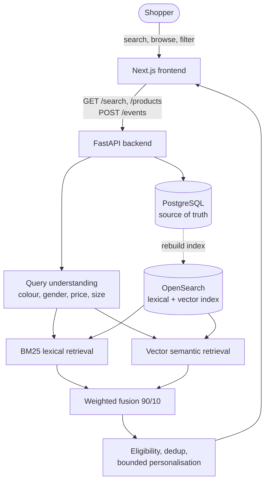

# StyleSeek

An original fashion e-commerce search **research prototype** used to answer:

To what extent does hybrid lexical and semantic retrieval, followed by learning-to-rank,
improve fashion-product search relevance compared with a tuned BM25 baseline?

>or more simply,
>can you make product search smarter, and can you actually prove it's smarter rather than just assuming it is?

Built from a static page to a hybrid BM25 + vector search service with query
understanding, safety filtering, and bounded personalisation — each stage measured against the
one before it, with rejected approaches kept and documented rather than deleted.

**Scope.** In scope: a responsive storefront, a real product catalogue (products, variants,
prices, stock), hybrid lexical+semantic retrieval, transparent eligibility rules, learning-to-
rank (attempted, not promoted — see Results below), and bounded anonymous session
personalisation. Deliberately out of scope: real payments/fulfilment, any retailer's branding or
proprietary assets, a production-scale identity platform, unrestricted LLM control of ranking,
and any model promoted without enough genuine interaction data to justify it.

## Architecture



Full component-by-component detail (data model, offline training path, deployment roles,
failure/fallback behaviour) is in
[`docs/architecture/STYLESEEK_ARCHITECTURE.md`](docs/architecture/STYLESEEK_ARCHITECTURE.md).

## What's actually here

- **Frontend**: Next.js — search, category browsing, product detail, basket simulation.
- **Backend**: FastAPI — `/search`, `/products`, `/events`.
- **Data**: PostgreSQL (source of truth, 44,446 real products from a Kaggle dataset, MIT
  licensed) + OpenSearch (BM25 lexical + vector kNN semantic index).
- **Search**: BM25 (boosted fields, synonym expansion) fused with vector semantic retrieval
  (`BAAI/bge-small-en-v1.5`) at a measured 90/10 weighting, behind a deterministic query
  parser (colour/gender/price/size as hard constraints) and stock/duplicate safety filtering.
- **Personalisation**: bounded, same-session, colour-only, and never overrides an explicit query.
- **What's *not* live**: a learned re-ranker. Three model families were tried and measurably
  underperformed the hand-tuned fusion baseline on the data available — see
  [`evaluation/final_evaluation.md`](evaluation/final_evaluation.md#negative-results-carried-into-this-conclusion).
- **Visual similarity** ("Similar styles" on the product page) — CLIP image embeddings, a
  genuinely optional extension beyond the frozen core plan. See
  [`docs/model_cards/visual_similarity_v1.md`](docs/model_cards/visual_similarity_v1.md) for what
  it does well (structured objects like shoes/watches) versus its honest limitation
  (colour/background-dominated matching for flat garment photos).

## Quick start

**Local (two terminals), needs Python 3.12+/Node 22+ and a Postgres/OpenSearch connection
string:**

```bash
# create backend/.env or database/.env from backend/.env.example first
cd backend && pip install -r requirements.txt && python run.py       # http://localhost:8000
cd frontend && npm install && npm run dev                             # http://localhost:3000
```

**Docker Compose** (see [`docker-compose.yml`](docker-compose.yml) — Postgres/OpenSearch
themselves stay managed cloud services, not containerised; this just runs backend+frontend
against them):

```bash
# create a .env with DATABASE_URL and OPENSEARCH_URL next to docker-compose.yml
docker compose up --build
```

Postgres and OpenSearch are managed free-tier services in this project (Neon, Bonsai) rather
than local installs — see `docs/risk_register.md`'s "complex local setup" entry for why.

## Try it yourself

Once both are running, open `http://localhost:3000` in a browser and search. A few queries that
show off different parts of the system:

- `black nike shoes` — exact brand/product match
- `red dress under £50` — price shown as a hard constraint in the results
- `smart casual blazer` — semantic match on occasion, not just keywords
- `grren shrt` — a deliberate typo, to see a known, documented limitation rather than a hidden one
- Open any product page for a "Similar styles" section (visual similarity, not text search)
- Click into a couple of products of the same colour, then run a broad search like `dress` again
  in the same browser tab — session personalisation nudges that colour toward the top, but never
  overrides an explicit colour in a later search

Every response also shows `model_version` and `fallback_used` in the browser's network tab
(`GET /search`), so you can see exactly which retrieval path actually served it. For a longer,
scripted walkthrough with real `curl` commands (including the API responses), see
[`docs/demonstration_script.md`](docs/demonstration_script.md).

## Running the tests

```bash
python -m pytest tests/unit -q                    # hermetic, no external services (also what CI runs)
python -m pytest tests/ -q                          # everything, needs DATABASE_URL/OPENSEARCH_URL
node tests/accessibility/check_axe.js               # needs the frontend dev server running
python monitoring/report.py                         # real /search latency, fallback rate, etc.
```

`.github/workflows/ci.yml` runs the hermetic suite, a frontend build, and a Docker build smoke
test on every push — see [`docs/monitoring.md`](docs/monitoring.md) for what's and isn't covered
in CI and why.

## Results:

Six configurations were measured before picking one. Weighted 90/10 lexical/semantic fusion beat
tuned BM25 alone on both ndcg@10 and recall@50 at once — the only one of the three fusion
strategies tried that managed that — and is what's live today (`hybrid_weighted_fusion_v1`):


On a genuinely held-out 3-query test split — never used to tune anything — that same
configuration scored ndcg@10 0.660, recall@50 0.667; read with the small-n caveat in
[`evaluation/final_evaluation.md`](evaluation/final_evaluation.md), which matters more than the
number. **Rejected along the way** (kept, not deleted — architecture's negative-result policy):
BM25 fuzzy matching (fixed typos, broke everything else), category/occasion as hard filters
(looked safe, measurably wasn't), three learned-ranking model families (all underperformed the
simpler baseline — not enough training data yet), parallel retrieval via a thread pool (measured
*slower* than sequential on this platform). Full trail with numbers:
[`experiments/experiment_register.md`](experiments/experiment_register.md) ·
[`evaluation/final_evaluation.md`](evaluation/final_evaluation.md#negative-results-carried-into-this-conclusion).

## How this was built

Baseline first, measure before promoting, keep negative results, hard constraints before soft
preference — see [`docs/architecture/STYLESEEK_ARCHITECTURE.md`](docs/architecture/STYLESEEK_ARCHITECTURE.md#4-architecture-principles)
for the full methodology this followed.

## Documentation map

| Doc | What's in it |
|---|---|
| [`docs/architecture/STYLESEEK_ARCHITECTURE.md`](docs/architecture/STYLESEEK_ARCHITECTURE.md) | The governing architecture (mirrors the original `STYLESEE1.docx`) |
| [`docs/project_charter.md`](docs/project_charter.md) | Research question, scope, intended outcomes |
| [`experiments/experiment_register.md`](experiments/experiment_register.md) | Every experiment run, accepted or rejected, with numbers |
| [`docs/risk_register.md`](docs/risk_register.md) | Every risk/assumption, resolved or still open, with evidence |
| [`docs/decisions/`](docs/decisions/) | Architecture decision records (ADRs) |
| [`evaluation/final_evaluation.md`](evaluation/final_evaluation.md) | The held-out result and full negative-results account |
| [`docs/model_cards/hybrid_search_v1.md`](docs/model_cards/hybrid_search_v1.md) | The live serving configuration, its data, evaluation, and limitations |
| [`docs/model_cards/visual_similarity_v1.md`](docs/model_cards/visual_similarity_v1.md) | The optional "Similar styles" extension — CLIP image embeddings, qualitative evaluation |
| [`docs/data_sheets/catalogue_data_sheet.md`](docs/data_sheets/catalogue_data_sheet.md) | Dataset provenance, licence, synthetic-field disclosure |
| [`docs/ethics/README.md`](docs/ethics/README.md) | Privacy, bias/fairness, explainability, open ethical gaps |
| [`docs/monitoring.md`](docs/monitoring.md) | Operational runbook, failure playbook, restore steps |
| [`docs/cost.md`](docs/cost.md) | Storage usage, service tiers, what's £0 vs unmeasured |
| [`docs/demonstration_script.md`](docs/demonstration_script.md) | A scripted stakeholder walkthrough — real commands, wins and known gaps both shown |
| [`evaluation/relevance_rubric.md`](evaluation/relevance_rubric.md) | How queries were graded for the evaluation harness |

## Repository layout

```
frontend/        Next.js app
backend/         FastAPI app
database/        schema migrations, ingestion
search/          OpenSearch indexing, BM25, vectors, fusion
ml/              learning-to-rank features (retained, not live — see experiment register)
experiments/     every experiment, accepted or rejected, reproducible
evaluation/      relevance judgments, metrics harness, final evaluation
tests/           unit, integration, data_quality, search_regression, sync, drift, accessibility
monitoring/      operational report against live search_request data
docs/            architecture, decisions, model cards, data sheets, ethics, risk
```

## Licence and provenance

Catalogue data: `paramaggarwal/fashion-product-images-small` (Kaggle), confirmed **MIT**
licensed — see [`docs/data_sheets/catalogue_data_sheet.md`](docs/data_sheets/catalogue_data_sheet.md).
Price, stock quantity and size runs are synthetic and flagged as such in the schema, not
presented as real. No retailer branding, imagery, or proprietary code is used
anywhere in this project.
